# Wazefne Diagrams

This file contains high-level and detailed diagrams for the Wazefne application. The diagrams are written in Mermaid syntax so they can be rendered by GitHub, many IDE Markdown previews, and Mermaid-compatible documentation tools.

## 1. System Summary

Wazefne is a marketplace for local services in Lebanon. A signed-in user can act as a client, a service provider, or both. The platform supports profile setup, provider browsing, favorites, reviews, chat, direct booking offers, job posting, job bidding, booking history, and AI CV analysis.

Core systems:

- Frontend: Angular application in `Frontend/`.
- Backend: Express/TypeScript REST API in `Backend/`.
- Database: PostgreSQL hosted on Supabase.
- Realtime: Supabase Realtime subscriptions from the Angular app.
- Auth: Clerk.
- AI: Gemini for CV analysis.
- Storage: Supabase Storage for portfolio uploads.

## 2. Use Case Model

### 2.1 Use Case Diagram

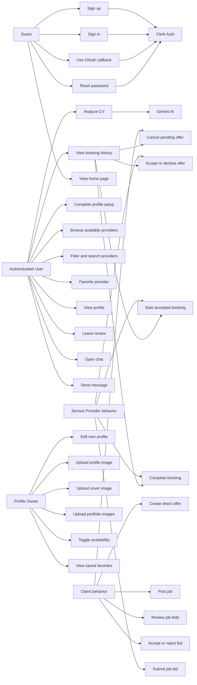


## 3. C4-Style Architecture

### 3.1 Level 1: System Context

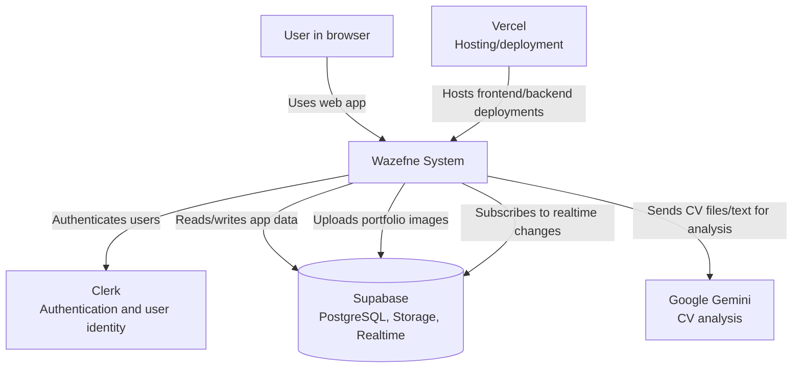

### 3.2 Level 2: Container Diagram

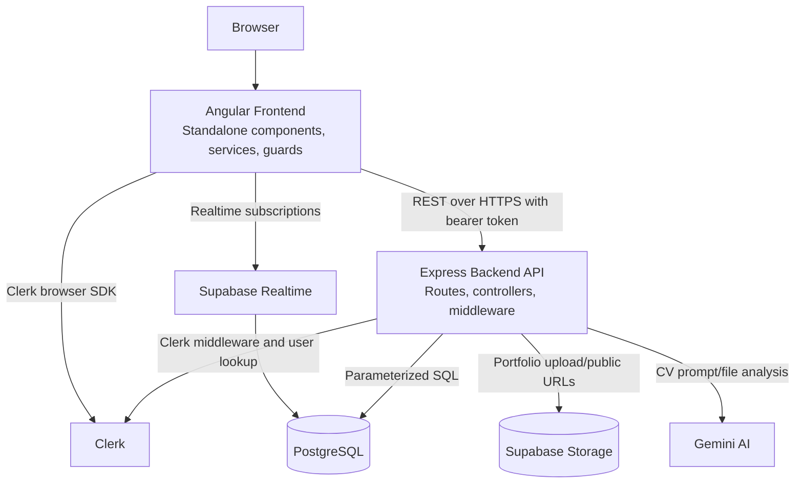

### 3.3 Level 3: Backend Components

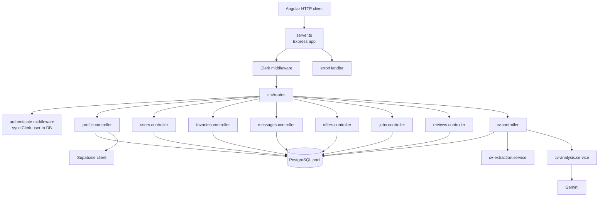

### 3.4 Level 3: Frontend Components

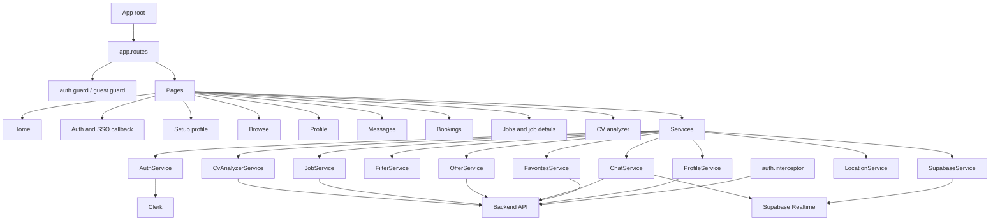

## 4. Data Model

### 4.1 Entity Relationship Diagram

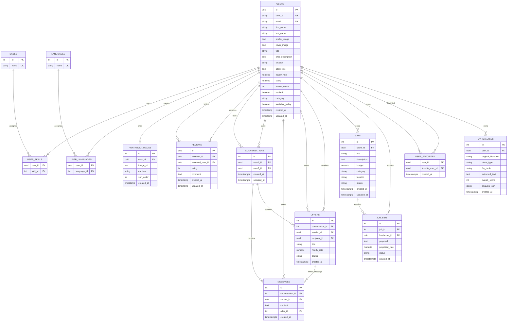

## 5. State Models

### 5.1 Offer State Diagram

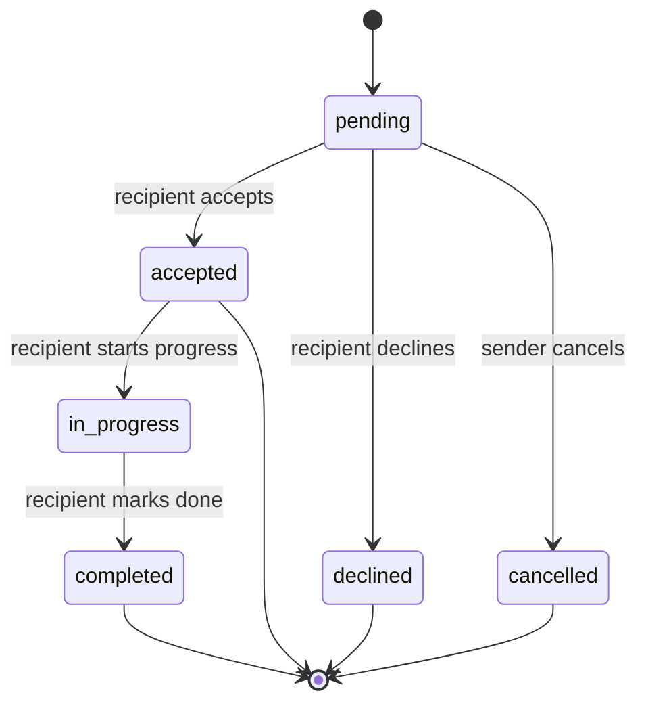

### 5.2 Job State Diagram

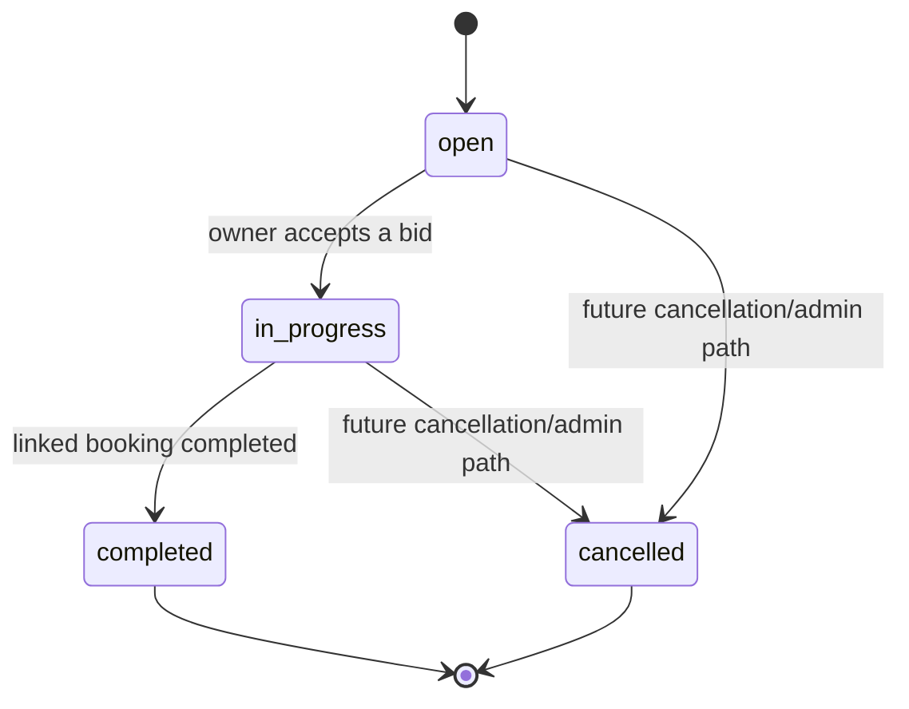

### 5.3 Bid State Diagram

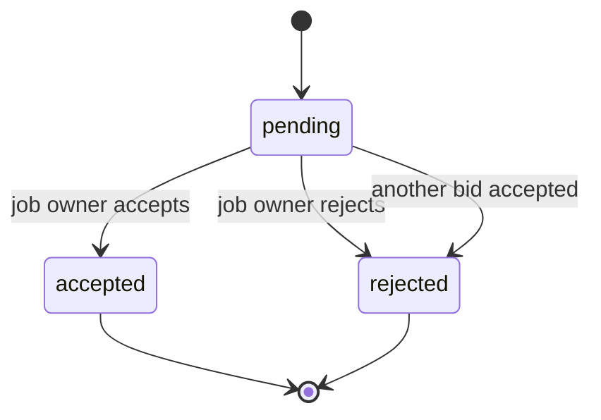

## 6. Activity Diagrams

### 6.1 Sign Up And Profile Setup

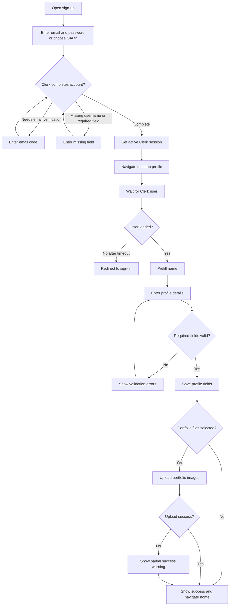

### 6.2 Browse, Favorite, And Contact Provider

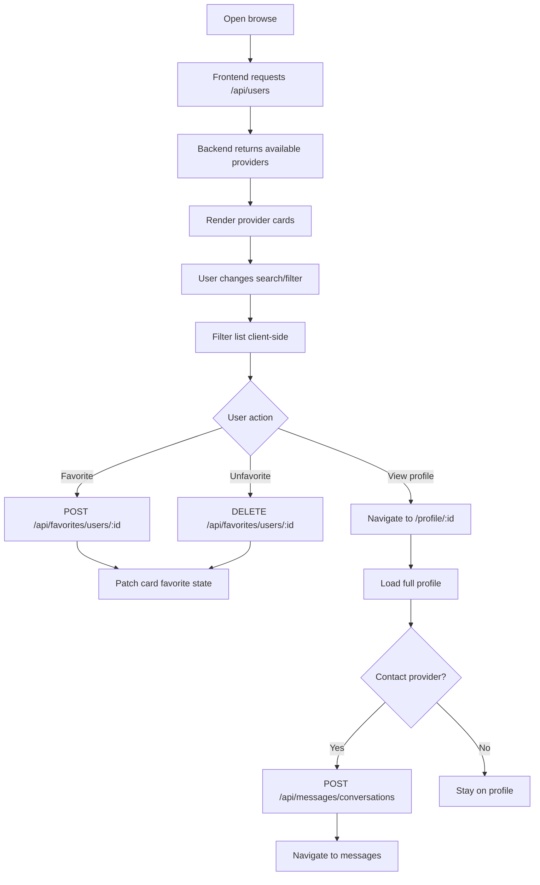

### 6.3 Direct Booking Offer

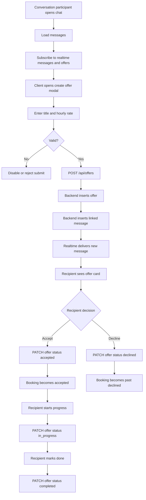

### 6.4 Reverse Marketplace Job Flow

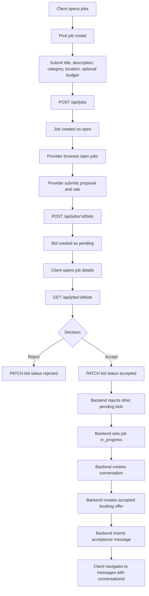

### 6.5 CV Analysis

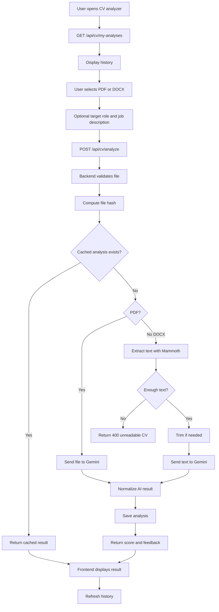

## 7. Sequence Diagrams

### 7.1 Authenticated API Call And User Sync

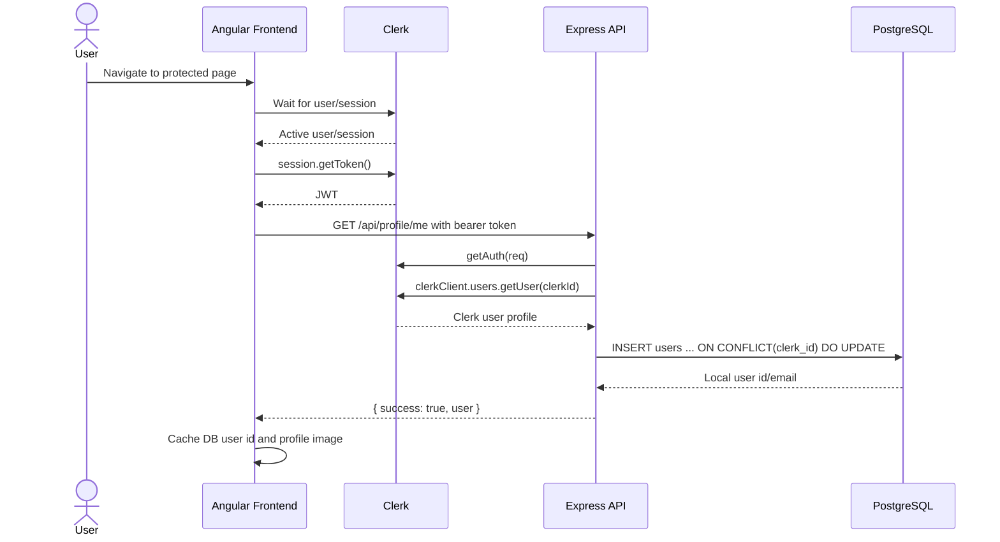

### 7.2 Browse Providers

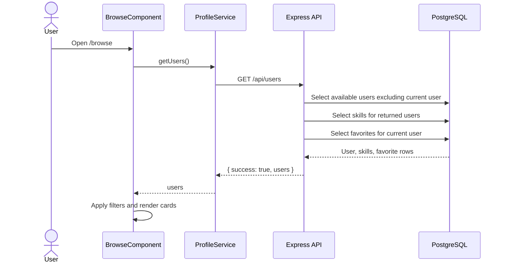

### 7.3 Send Message With Realtime Update

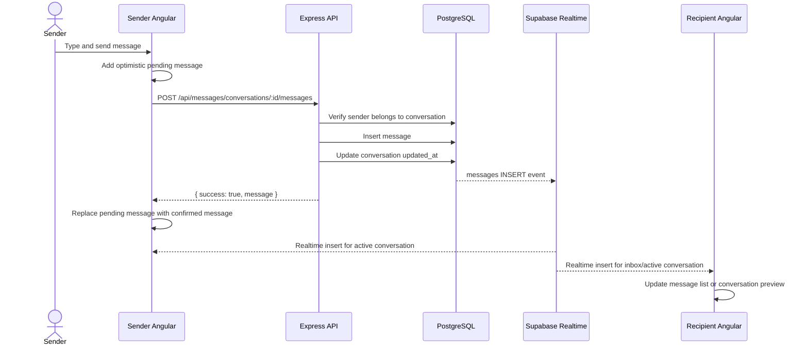

### 7.4 Direct Offer Lifecycle

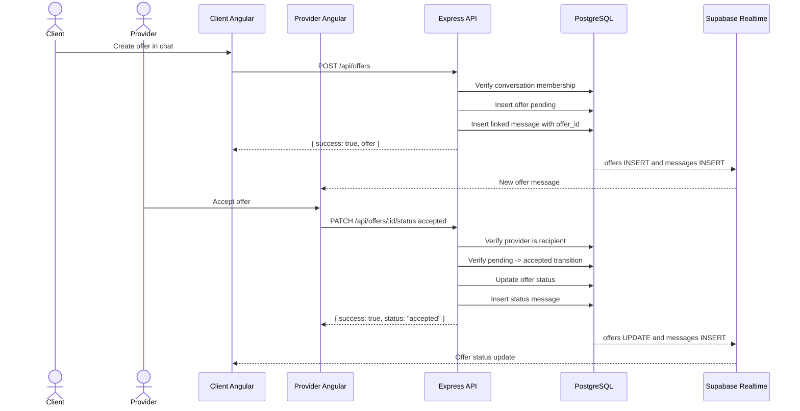

### 7.5 Accept Job Bid

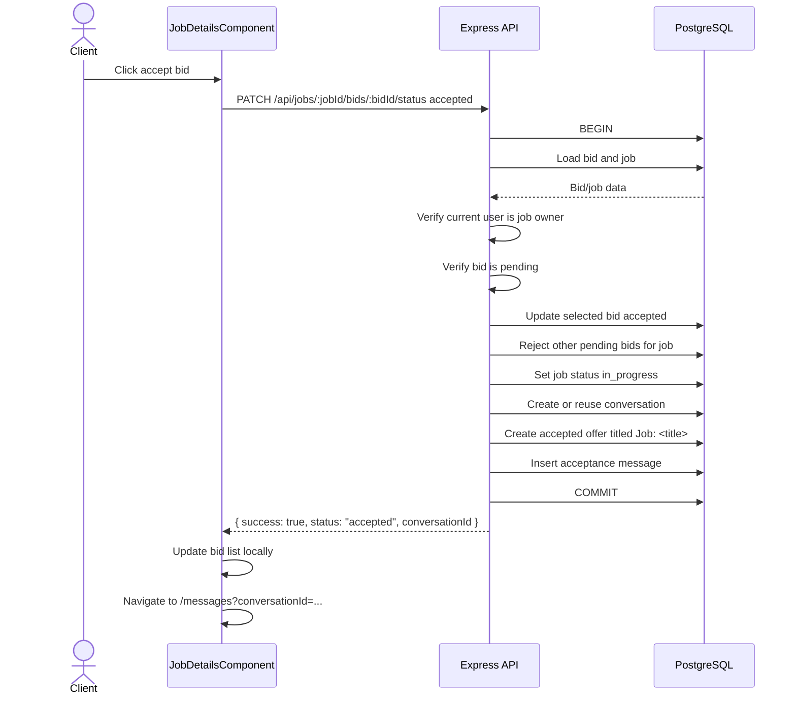

### 7.6 CV Analysis

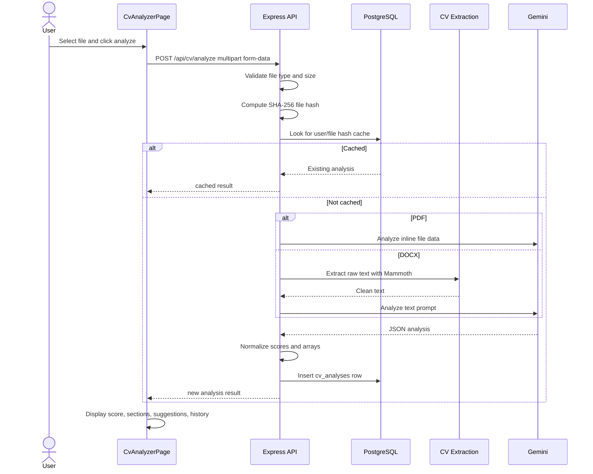

## 8. Data Flow Diagram

```mermaid
flowchart LR
    User[User]
    Angular[Angular UI]
    AuthInterceptor[Auth Interceptor]
    Express[Express API]
    Clerk[Clerk]
    Postgres[(PostgreSQL)]
    SupabaseStorage[(Supabase Storage)]
    SupabaseRealtime[Supabase Realtime]
    Gemini[Gemini]

    User -->|Forms, clicks, uploads| Angular
    Angular -->|Clerk SDK auth flows| Clerk
    Angular --> AuthInterceptor
    AuthInterceptor -->|Bearer token REST calls| Express
    Express -->|Verify auth and fetch user| Clerk
    Express -->|Profiles, jobs, offers, messages, reviews, favorites, CV history| Postgres
    Express -->|Portfolio file upload| SupabaseStorage
    Express -->|CV PDF/text prompt| Gemini
    Postgres -->|DB insert/update events| SupabaseRealtime
    SupabaseRealtime -->|Realtime messages/offers| Angular
    Express -->|JSON responses| Angular
    Angular -->|Rendered UI state| User
```
